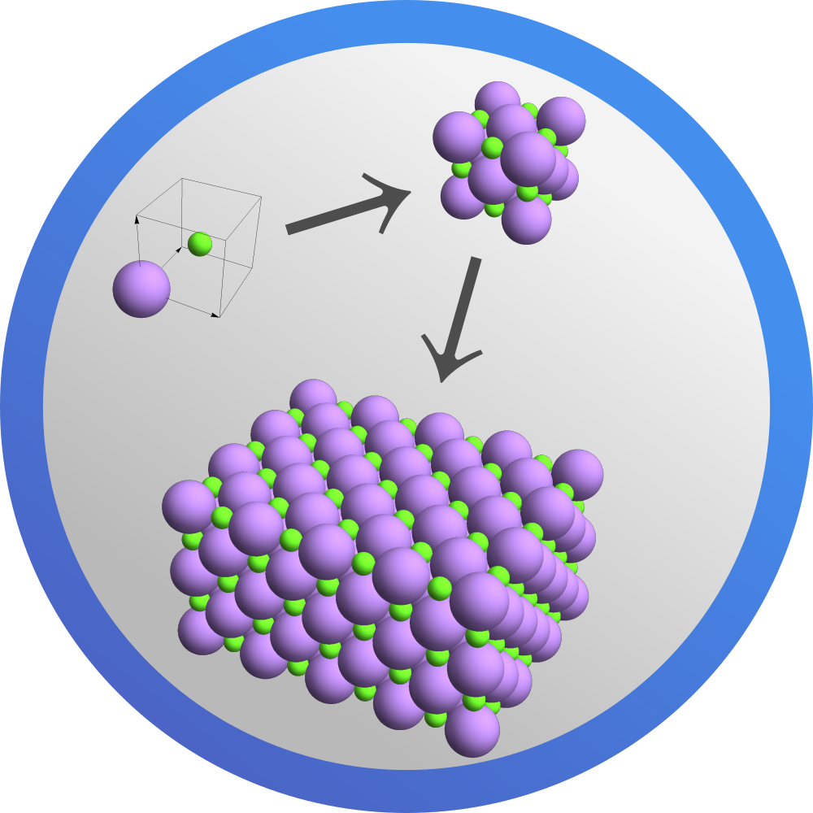
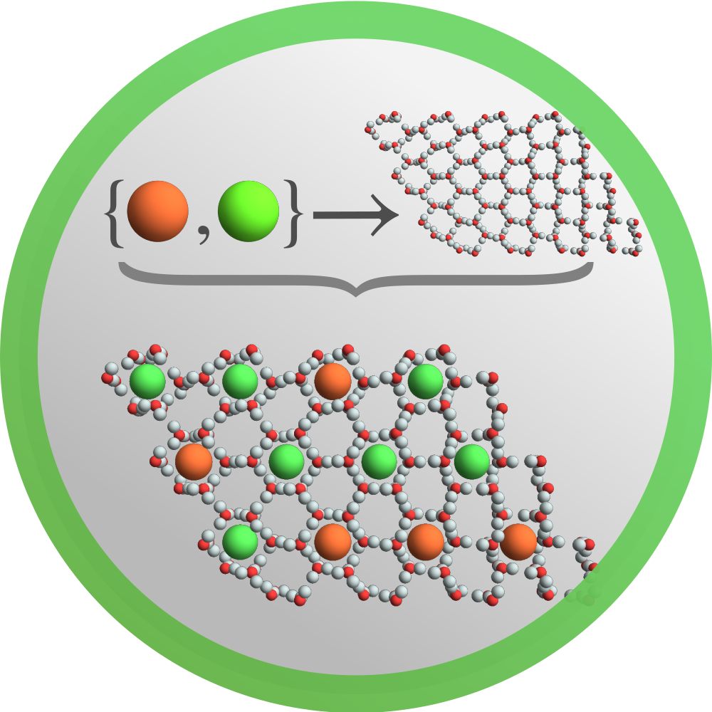
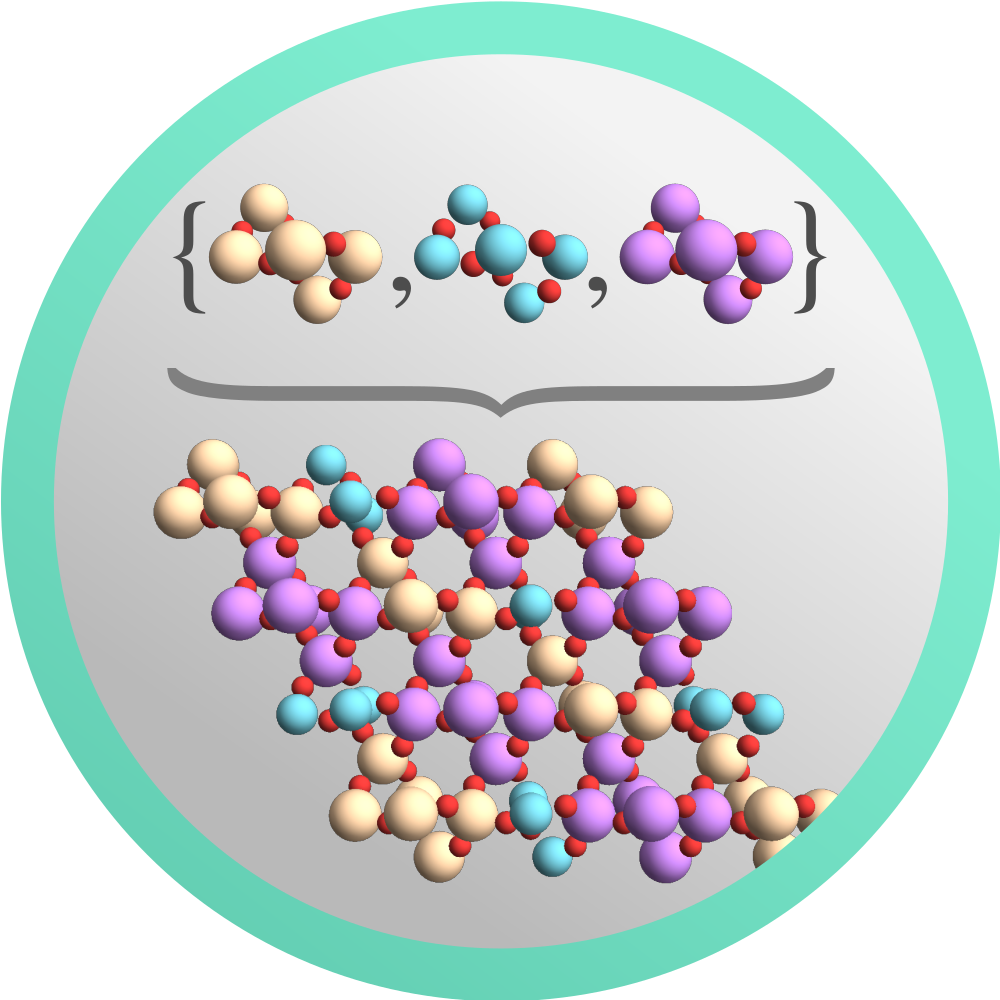

# _MaXrd_: Mathematica X-ray diffraction package

A comprehensive _Mathematica_ package for crystallographic computations, _MaXrd_, has been developed. It comprises space group representations based on _International Tables for Crystallography_, volume A together with scattering factors from _XOP_ and cross sections from [_xraylib_](https://github.com/tschoonj/xraylib).
Featured functionalities include calculation of structure factors, linear absorption coefficients and crystallographic transformations. The crystal data used by _MaXrd_ is normally generated from external _cif_ files.

The package comes with a dynamic documentation seamlessly integrated with the _Mathematica_ system, including code, examples, details and options. From the onset, minimal _Mathematica_ experience is required to make use of the package. It may be a helpful supplement in research and teaching where crystallography and X-ray diffraction are essential. Although _Mathematica_ is a proprietary software, all the code of this package is open source. It may easily be extended to cover user-specific applications.

The article **Using _Mathematica_ as a platform for crystallographic computing** was published in the Journal of Applied Crystallography in February 2019 ([Ramsnes, S., Larsen, H. B. & Thorkildsen, G. (2019). J. Appl. Cryst. 52, 214–218](https://doi.org/10.1107/S1600576718018071)).
In 2020, an update article **_MaXrd_ updated with emphasis on model construction and reciprocal-space simulations** ([Ramsnes, S. P., Larsen, H. B. & Thorkildsen, G. (2020). J. Appl. Cryst. 53, 1620–1624](https://doi.org/10.1107/S160057672001328X)) was published in the same journal.

The author's PhD thesis from 2022, [**Direct- and reciprocal space structure modelling: Contributions to the advanced understanding of inclusion compounds**](https://hdl.handle.net/11250/2995486), describes much of the capabilities in great detail from a research perspective.

## Functionality

An overview of the available functions can be found in the [wiki](https://github.com/Stianpr20/MaXrd/wiki).
The main documentation is accessible in _Mathematica_ once the package is installed.
Some of the highlights and newest features are listed below:

### Import crystal data


Core crystallographic information can be be read from `cif` files using `ImportCrystalData`.
Data will persist in the local `$UserBaseDirectory`, readily accessible with `$CrystalData`.
The simple but convenient function `CrystalPlot` can visualise the structure.
<br> <br> <br>

### Symmetry generation



Symmetry-related functions can be used for basic operations on reflections and positions, and also to grow the asymmetric unit into an arbitrary large structure.
Essentials of the _International Tables, vol. A_ are stored in `$SpaceGroups`.
There is also `UnitCellTransformation` for changing between equivalent cell descriptions.
<br> <br>

### Structure customisation



Written with inclusion compounds in mind, `EmbedStructure` is ideal for merging guest entities with a host structure at random, sequential or conditional positions.
Rotations and/or translations can be executed prior to placement with the same freedom.
The user can also specify a displacement field to shift everything by a relative amount with `DistortStructure`.
<br> <br>

### Synthesis and simulation



Structural pieces can be sewn together automatically with `SynthesiseStructure`, which is particularly useful when working with multiple domains.
When the model is complete, `SimulateDiffractionPattern` can be applied to render images through [DISCUS](https://github.com/tproffen/DiffuseCode) or [DIFFUSE](http://scripts.iucr.org/cgi-bin/paper?S1600576717015023).
<br> <br> <br>

## Getting started

### Installation

Download the latest paclet file and install it, or install from the web directly:

```Mathematica
PacletInstall["https://github.com/Stianpr20/MaXrd/releases/download/3.1.0/MaXrd-3.1.0.paclet"]
```

See [this post in the Wolfram Community](https://community.wolfram.com/groups/-/m/t/2825040) for an introductory overview (the notebook is found [in the root of this repository](https://github.com/Stianpr20/MaXrd/blob/master/Miscellaneous/MaXrd_demo_2023.nb)).

The latest version of _MaXrd_ is 3.1.0, which is compatible with _Mathematica_ version 12.1 and above.
It was built using the _PacletTools_ in _Mathematica_ 13.0.1.

Clone, fork or download the repository if you want to develop on the package.

### Using _MaXrd_

Load the package with:
> << MaXrd`

If you want _MaXrd_ to launch automatically on startup, first open the _Wolfram Language Documentation Center_. This can be done from the file menu: `Help -> Wolfram Documentation`. Scroll to the bottom and click on _Add-ons and Packages_. Click on the disclosure triangle next to _MaXrd_ to open the cell and then the same for _Manage_. Make sure the option _Startup_ is selected.

To access the package documentation, open the _Wolfram Documentation_ in _Mathematica_ after installing it and search for «MaXrd» or any related content.

## Contact

Any comments or feedback are welcome. Submit an [issue](https://github.com/Stianpr20/MaXrd/issues) in the repository.
